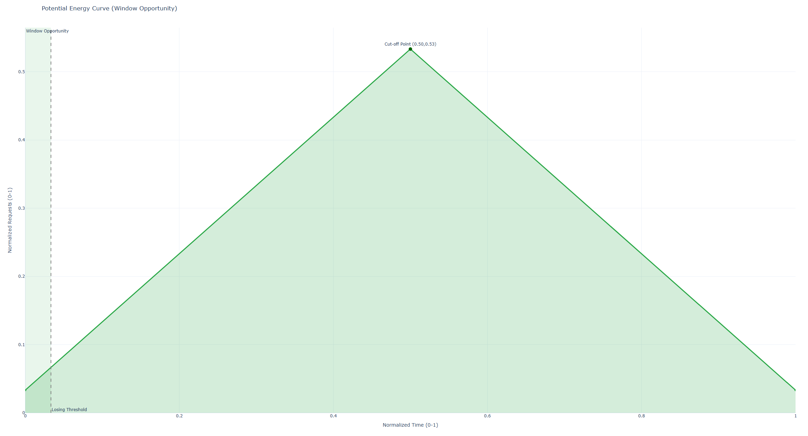
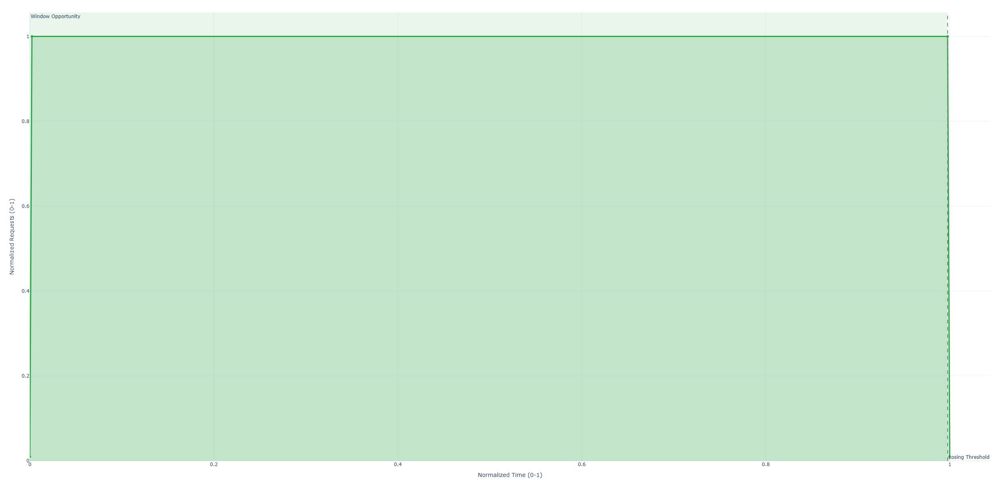
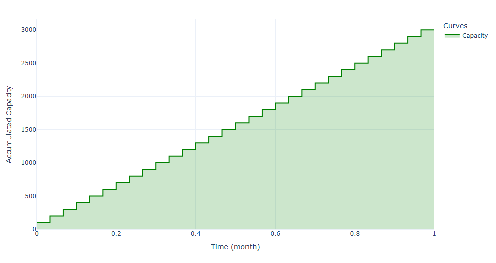

# Standardized Consumption Model Datasheet

> Plantilla reproducible para documentar los modelos de consumo de las APIs de los microservicios.

## Objetivo

Proveer una plantilla estandarizada que todos los miembros del grupo puedan usar para describir límites, cuotas, y configuración de consumo de APIs.

---

## Campos (explicación breve)

- **Associated SaaS:** Nombre del servicio externo o nota interna.
- **Type:** `Full` / `Partial` / `Internal` (según aplique).
- **(\*) Pricing Configurations:** Número de configuraciones / enlace a planes.
- **Capacity (Quota):** Límite temporal (ej. 10000 units/day). Indicar ventana (diaria/hora/minuto).
- **Auto-Recharge / Extra charge:** Si hay recarga automática o cargos extra.
- **Max Power (Rate Limit):** Límite de tasa (value) y tipo de throttling (sliding window, token bucket, etc.).
- **Per-Request cost:** Coste por petición en unidades (si aplica).
- **Cooling period:** Tiempo de enfriamiento / backoff recomendado.
- **Segmentation:** Segmentación de límites por usuario/tenant/IP (si aplica).
- **Shared limits:** Si hay límites compartidos entre endpoints/tenants.

---

## API Template

- **Associated SaaS:**
  - Type: TBD (To be determined)
  - (\*) Pricing Configurations: TBD
- **Segmentation:**
  - TBD
- **Capacity (Quota):**
  - Value: TBD
  - Window: TBD
- **Auto-Recharge:** TBD
- **Extra charge:** TBD
- **Max Power (Rate Limit):**
  - Value: TBD
  - Throttling: TBD
- **Per-Request cost:** TBD
- **Cooling period:** TBD
- **Shared limits:** TBD

---

## User and Profile Microservice

### Resend (API de envío de correos)

Hemos implementado a nivel de aplicación una API de envío de correos, el proveedor que mejor se ajustaba a nuestras condiciones ha sido _Resend_. Al hablar de las configuraciones me centraré en todos los planes de precios que ofrece Resend, pero en el resto de la ficha técnica de la API (capacity, rate limit, etc.) me centraré en el plan contratado en nuestra aplicación (**Free**).

También nos centraremos en el apartado de Transactional e-mails, no marketing e-mails. En ese aspecto comentar que las **cuotas** engloban tanto correos enviados como recibidos.

- **Associated SaaS**
  - Type: Partial SaaS (Email Service)
  - Pricing Configurations: **5** (Free, Pro, Scale, Scale + Dedicated IP Add-on, Enterprise )
- **Capacity (Quota)**:
  - Value: 100 emails / day
    - Auto-recharge: daily
    - Extra charge: None
  - Value: 3000 emails / month
    - Auto-recharge: monthly
    - Extra charge: None
  - Aplica tanto a enviados como recibidos
- **Max Power (Rate Limit):**
  - Value: 2 requests / second
- **Cooling Period:** TBD (Sin embargo se incluye la cabecera **x-retry-after** en la respuesta, pero no se indica cual es el tiempo)
- **Segmentation**:

  - **Account Level** (Authenticated), múltiples API Keys aplicarían sobre el mismo límite global de cuenta.

- **Curva de Oportunidad (sobre Cuota diaria):**
  Observamos como en la cuota diaria tenemos una ventana de oportunidad muy amplia, lo que nos permite tener margen para poder consumirlo a lo largo de dicha ventana.

- **Curva de Oportunidad (sobre Cuota mensual):** El panorama cambia en la cuota mensual, aunque es cierto que el tiempo está en días, lo cual tenemos un margen "amplio" la ventana de oportunidad es practicamente mínima, en el momento en el que un día no consumimos toda nuestra cuota contraemos pérdida de capacidad.

- **Curva de Capacidad**:

## Payments and Subscriptions

### Stripe (API de pagos)

Hemos integrado Stripe como el núcleo de nuestro módulo de pagos y suscripciones. Al igual que con otros proveedores, nos centramos en las configuraciones globale a nivel de Pricing, pero para los límites técnicos de la Datasheet nos basamos en el **Test Mode (Sandbox)**, que es el entorno que estamos usando para nuestra aplicación.

- **Associated Saas**
  - Type: Full SaaS
  - Pricing Configurations: **2** (Integrated/Custom), que se deben diferenciar de las dos _formas_ de usar la API (**Test Mode y Modo Live**).
- **Capacity (Quota)**:
  - Value: Ilimitado (no existe una cuota máxima)
- **Max Power (Rate Limit)**:
  - Value: 25 requests/segundo (Modo de prueba), este valor sube a 100 req/s en Modo Live
- **Cooling Period:** TBD (La documentación no indica un tiempo exacto, pero exige implementar un **Exponential Backoff** ante errores 429).

- **Segmentation**:
  - **Account Level (Authenticated)**: Todas las claves de API vinculadas a una cuenta comparten el mismo límite de 25 req/s

## Analytics and Dashboards

### Quotable (Open Source)

Al ser Open Source y funcionar en base a "best effort", muchos valores no están publicados o son desconocidos (se marca como "Unknown" cuando aplica, similar a la ficha de Spotify).

- **Associated SaaS**
  - Type: Partial SaaS (Data Provider)
  - (\*) Pricing Configurations: 1 (Open Source / Free) — https://github.com/lukePeavey/quotable
- **Segmentation:**
  - Unauthenticated / Anonymous: Yes
- **Capacity (Quota):**
  - Value: Not published
  - Window: Not specified
- **Auto-Recharge / Extra charge:**
  - Auto-Recharge: N/A
  - Extra charge: None (open source)
- **Max Power (Rate Limit):**
  - Value: 180 requests / minute (RPM)
  - Throttling/Circuit Breaker: IP Rate Limiting (Protección contra DDoS) / Fair Usage Policy (IP-based)
- **Per-Request cost:** 0 units (Free)
- **Cooling period:** TBD (Depends on IP block duration and ISP)
- **Shared limits:** Yes (Global pool for public access)

Notes: Al ser un servicio público y mantenido como proyecto OSS, no existe un SLA ni garantías de capacidad. Las políticas de uso justo y los límites pueden cambiar sin aviso.

---

### Azure Translator

Esta ficha muestra únicamente las características del plan F0 (plan gratuito).

- **Associated SaaS**
  - Type: Partial SaaS (Cloud API)
  - (\*) Pricing Configurations: Multiple (Free F0, S1, etc.) — https://learn.microsoft.com/en-us/azure/ai-services/translator/service-limits
- **Segmentation:**
  - Authenticated: Yes (API Key required)
- **Capacity (Quota):**
  - Value: 2,000,000 characters / hour (Tier F0)
  - Window: Hourly
- **Auto-Recharge / Extra charge:**
  - Auto-Recharge: Hourly
  - Extra charge: None (service stops when limit is reached)
- **Max Power (Rate Limit):**
  - Value: ~33,300 characters / minute
  - Throttling: Sliding Window (2M chars / 60 min)
- **Per-Request cost:** Variable (depends on the number of characters per request and the chosen SKU)
- **Cooling period:**
  - 1 Hour (if hourly quota exceeded — wait for next cycle)
- **Shared limits:** Subscription scope (limits and quota apply per subscription/resource)

---

## Referencias

- Quotable (GitHub): https://github.com/lukePeavey/quotable
- Azure Translator pricing: https://learn.microsoft.com/en-us/azure/ai-services/translator/service-limits

---

## Beats upload

### AWS S3 (Amazon Simple Storage Service)

El microservicio `beats-upload` utiliza AWS S3 para almacenar archivos de audio (beats) e imágenes de portada. Los usuarios suben archivos mediante URLs presignadas (Presigned POST), y el contenido se distribuye a través de CloudFront (CDN) con URLs firmadas para un streaming seguro.

Actualmente operamos bajo el **AWS Free Tier + créditos promocionales de AWS**, por lo que no se han definido cuotas de almacenamiento adicionales.

- **Associated SaaS**
  - Type: Full SaaS (Cloud Storage)
  - (\*) Pricing Configurations: 1 (Free Tier + AWS Promotional Credits)
- **Segmentation:**
  - Authenticated: Yes (IAM API Key for uploads, CloudFront for reads)
  - Bucket Policy: Private — only CloudFront distribution can read objects (`s3:GetObject`)
  - Bucket: `social-beats-storage`
  - Access Pattern: Uploads via IAM credentials + Presigned URLs, Downloads via CloudFront signed URLs only
- **Capacity (Quota):**
  - Storage: No limit defined (covered by Free Tier + promotional credits)
  - Max File Size: 15 MB (enforced via S3 POST policy conditions)
  - **Free Tier Limits (S3 Standard):**
    - Storage: 5 GB
    - PUT, COPY, POST, LIST requests: 2,000 requests/month
    - GET requests and other requests: 20,000 requests/month
  - Window: Monthly
- **Auto-Recharge / Extra charge:**
  - Auto-Recharge: Monthly (Free Tier resets each month)
  - Extra charge: None while within Free Tier limits + promotional credits buffer
- **Max Power (Rate Limit):**
  - AWS Default: 3,500 PUT/COPY/POST/DELETE requests/s per prefix, 5,500 GET/HEAD requests/s per prefix
  - Application Limit: 5 concurrent S3 operations (bottleneck limiter)
  - Throttling: Local concurrency control via bottleneck + toobusy-js for event loop protection
- **Per-Request cost (S3 Standard, post Free Tier):**
  - PUT, COPY, POST, LIST requests: $0.005 per 1,000 requests
  - GET, SELECT and all other requests: $0.0004 per 1,000 requests
  - DELETE requests: Free
  - Storage (first 50 TB/month): $0.023 per GB
  - Storage (next 450 TB/month): $0.022 per GB
  - Storage (over 500 TB/month): $0.021 per GB
- **Cooling period:**
  - 5 seconds (retry-after header on 503 Service Unavailable when server is overloaded)
- **Shared limits:** No (bucket exclusive to beats-upload microservice)

**Additional Notes:**

- **Operations Used:** PutObject, GetObject, DeleteObject, Presigned POST/GET URLs
- **File Types:** Audio (mp3, wav, flac, aac) and images (jpg, png, webp)
- **Stability Controls:** toobusy-js guards against event loop lag; Bottleneck limits concurrent operations
- **CDN Integration:** CloudFront distributes content with signed URLs (2-hour expiration for streaming)
- **Compensation Pattern:** Orphaned S3 files are deleted if database operations fail

---

## Referencias

- AWS S3 Pricing: https://aws.amazon.com/s3/pricing/

---

## Beats interaction

### OpenRouter API (meta-llama/llama-3.2-3b-instruct:free)

Hemos integrado la API de OpenRouter para moderar el contenido de la aplicación. Actualmente se modera el título y descripción de las playlists, los comentarios y el texto de los ratings. Hemos decidido usar la versión gratuita de OpenRouter y el modelo **meta-llama/llama-3.2-3b-instruct:free** (uno de los recomendados por la documentación oficial). Para evitar exceder el límite y ser baneados, hemos implementado un rate-limit algo conservador, hacemos un máximo de 18 requests por minuto y 45 diarias. La forma de funcionamiento es que si algo no se puede moderar en el momento, cuando el SLA lo permita, un CronJob lo hará.

- **Associated SaaS**
  - Type: Partial SaaS (AI Model Gateway / API Aggregator)
  - (\*) Pricing Configurations: Multiple (Free tier, Pay-as-you-go, Enterprise) — https://openrouter.ai/pricing
- **Segmentation:**
  - Authenticated: Yes (API Key required)
  - Model-specific: Yes (Free tier applies only to models with `:free` suffix)
- **Capacity (Quota):**
  - Value: 50 requests / day (accounts without credits)
  - Value: 1,000 requests / day (accounts with ≥ $10 credits purchased)
  - Window: Daily (resets at midnight UTC)
- **Auto-Recharge / Extra charge:**
  - Auto-Recharge: Daily (quota resets automatically each day)
  - Extra charge: None for free models (requests are blocked after reaching daily limit; paid models require credits)
- **Max Power (Rate Limit):**
  - Value: 20 requests / minute (RPM)
  - Throttling: Sliding Window (1 minute)
- **Per-Request cost:** 0 credits (Free model variant)
- **Cooling period:**
  - 1 Minute (if rate limit exceeded — wait for sliding window to reset)
  - 1 Day (if daily quota exceeded — wait for next daily cycle)
  - Note: Failed requests (429 errors) still count toward daily quota
- **Shared limits:** API Key scope (limits apply per API key across all free models with `:free` suffix)

**Additional Notes:**

- **Model:** meta-llama/llama-3.2-3b-instruct:free (3.21B parameters, multilingual, 128K context window)
- **DDoS Protection:** Cloudflare protection active; excessive usage may trigger additional blocks
- **402 Errors:** May occur if account has negative credit balance (even for free models)
- **429 Errors:** Indicates rate limit or quota exceeded; backoff and retry recommended
- **Provider Rate Limiting:** Free-tier models may experience additional rate limiting during peak times at provider level
- **No SLA:** Free tier operates on best-effort basis without service guarantees
- **Upgrade Benefits:** Purchasing ≥ $10 credits increases daily quota from 50 to 1,000 requests
- **API Compatibility:** OpenAI-compatible API format (easy migration/integration)

---

## Referencias

- OpenRouter API Documentation: https://openrouter.ai/docs
- Rate Limits Documentation: https://openrouter.ai/docs/limits
- Model Details: https://openrouter.ai/meta-llama/llama-3.2-3b-instruct:free
- Pricing: https://openrouter.ai/pricing

---
