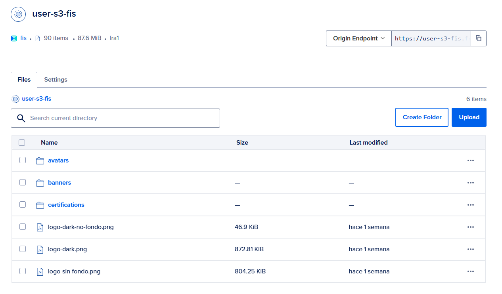
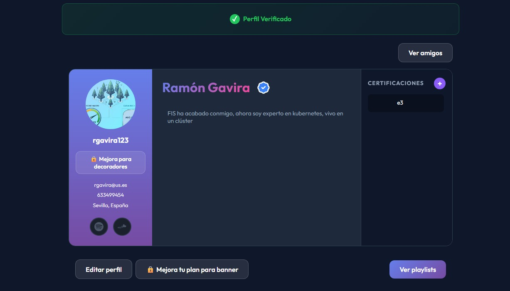

# Nivel de acabado del microservicio user-auth

> **Nota**: Todas las referencias a archivos de código en este documento incluyen hipervínculos directos al repositorio de GitHub para facilitar su acceso y revisión.

## 1. User-auth

**Pareja**: Benjamin Ignacio Maureira Flores y Ramon Gavira Sanchez

## 2. Nivel de acabado

**Nivel objetivo**: 10 - Se opta a máxima puntuación porque el microservicio implementa:

## MICROSERVICIO BÁSICO QUE GESTIONE UN RECURSO

### El backend debe ser una API REST tal como se ha visto en clase implementando al menos los métodos GET, POST, PUT y DELETE y devolviendo un conjunto de códigos de estado adecuado: ✅

Tenemos todos los endpoints necesarios para la gestión completa de usuarios y perfiles. CRUD de perfiles y operaciones de autenticación, además de rutas para administradores y rutas dedicadas a features, como el 2FA o la subida de archivos. Todo el código se encuentra en [`src/routes`](https://github.com/SocialBeats/user-auth/tree/main/src/routes), [`src/services`](https://github.com/SocialBeats/user-auth/tree/main/src/services) y [`src/controllers`](https://github.com/SocialBeats/user-auth/tree/main/src/controllers).

---

### <a name="autenticacion"></a>La API debe tener un mecanismo de autenticación: ✅

Este microservicio **ES** el encargado de la autenticación, somos los proveedores de tokens que se usan en el flujo de comunicación entre los demás microservicios, usando los endpoints de `login`, `logout` y `refresh`. Hemos implementado JWT (Access y Refresh tokens) con rotación de tokens y lista negra en Redis. Sin embargo, la autenticación y comprobación de firma del token se realiza en la API Gateway, el middleware [`src/middlewares/authMiddlewares.js`](https://github.com/SocialBeats/user-auth/blob/main/src/middlewares/authMiddlewares.js) se encarga de inyectar los valores del token en nuestras peticiones para poder ser usados en el microservicio.

---

### Debe tener un frontend que permita hacer todas las operaciones de la API: ✅

Integrado en el [repositorio común de frontend](https://github.com/SocialBeats/frontend). Incluye vistas de login, registro, recuperación de contraseña, configuración de perfil, activación de 2FA y gestión de cuenta. Rutas principales en el frontend: `/auth/*` y `app/profile/*`. Gracias a la creación de un [cliente de Axios](https://github.com/SocialBeats/frontend/tree/develop/src/api) y el [uso de servicios](https://github.com/SocialBeats/frontend/tree/develop/src/services) en el frontend, podemos interactuar con la API

---

### Debe estar desplegado y ser accesible desde la nube: ✅

Desplegado en el clúster de Kubernetes de Digital Ocean junto al resto de la aplicación. https://socialbeats.es/socialbeats

---

### La API que gestione el recurso también debe ser accesible en una dirección bien versionada: ✅

Endpoints disponibles bajo el prefijo `/api/v1`.

---

### Se debe tener una documentación de todas las operaciones de la API incluyendo las posibles peticiones y las respuestas recibidas: ✅

Definido en [`spec/oas.yaml`](https://github.com/SocialBeats/user-auth/blob/main/spec/oas.yaml) usando Swagger/OpenAPI 3.0.

---

### Debe tener persistencia utilizando _MongoDB_ u otra base de datos no SQL: ✅

Conexión gestionada en [`src/db.js`](https://github.com/SocialBeats/user-auth/blob/main/src/db.js). Colecciones `users` y `profiles`.

---

### Deben validarse los datos antes de almacenarlos en la base de datos (por ejemplo, haciendo uso de _mongoose_): ✅

Validaciones en esquemas de Mongoose ([`src/models/User.js`](<(https://github.com/SocialBeats/user-auth/blob/main/src/models/User.js)>), [`src/models/Profile.js`](<(https://github.com/SocialBeats/user-auth/blob/main/src/models/Profile.js)>)) y validaciones lógicas adicionales en servicios.

---

### Debe haber definida una imagen Docker del proyecto: ✅

Imagen disponible en Docker Hub `socialbeats/user-auth:latest`. Se utiliza [`Dockerfile`](https://github.com/SocialBeats/user-auth/blob/main/Dockerfile).

---

### Gestión del código fuente (Git Flow): ✅

Código en GitHub siguiendo la metodología de ramas del grupo. [Metodología de Trabajo](https://github.com/SocialBeats/docs/blob/main/work_methodology/work_methodology.md)

---

### Integración continua: ✅

Workflows en [`.github/workflows/`](https://github.com/SocialBeats/user-auth/tree/main/.github/workflows) para CI (tests), linter y CD (release).

---

### Debe haber pruebas de componente implementadas en Javascript para el código del backend utilizando Jest o similar: ✅

Tests implementados con **Vitest**. Incluye unidad ([`tests/unit`](https://github.com/SocialBeats/user-auth/tree/main/tests/unit)) e integración ([`tests/integration`](https://github.com/SocialBeats/user-auth/tree/main/tests/integration)). Hemos puesto especial énfasis en la seguridad (casos negativos de auth, tokens expirados, 2FA).

## MICROSERVICIO AVANZADO QUE GESTIONE UN RECURSO

### Implementar un frontend con rutas y navegación: ✅

El frontend común utiliza `react-router` para gestionar la navegación entre las diferentes vistas de registro, login, verificación, perfil, etc.

- Rutas principales en el frontend: `/auth/*` y `app/profile/*`.
- Rutas en

---

### Usar el patrón materialized view para mantener internamente el estado de otros microservicios: ❌

---

### Implementar cachés o algún mecanismo para optimizar el acceso a datos de otros recursos: ✅

Se utiliza **Redis** para el almacenamiento y validación de Refresh Tokens, gestión de tokens temporales para 2FA y listas de revocación (blacklist) para logout seguro. Las consultas que necesiten autenticación y lleguen a la API Gateway hacen uso de **nuestro Redis** para validar que el token es válido o no ha sido revocado. Todo esto se consigue gracias a un servicio en la Gateway que se comunica con nuestro microservicio. [`tokenValidationService.js`](https://github.com/SocialBeats/api-gateway/blob/main/src/services/tokenValidationService.js)

Se hace uso de la CDN implementada en el S3 de Digital Ocean para la distribución optimizada de contenido estático (imágenes y archivos PDF). Se generan URLs firmadas para acceso seguro y de baja latencia desde el borde (edge). Disponible en [`src/config/s3.js`](https://github.com/SocialBeats/user-auth/blob/main/src/config/s3.js)

> Nota: En algún momento del desarrollo la CDN tuvo problemas de acceso y se accede a las URLs de los archivos en el origen, sin pasar por el CDN. Por este motivo se dejó como variable en el código la URL del S3, pudiendo alternar el acceso a la CDN o al S3 directamente.

---

### Consumir alguna API externa a través del backend o algún otro tipo de almacenamiento de datos en cloud (S3): ✅

- Integración con **Resend** para el envío transaccional de correos electrónicos (verificación, reset de password).
- Integración con [**Persona**](https://docs.withpersona.com/api-introduction) para la verificación de identidad y prueba de vida de los usuarios.
- Integración con **S3** de Digital Ocean para la subida de archivos (avatar, banner y certificaciones).



---

### Implementar el patrón “rate limit” al hacer uso de servicios externos: ✅

Implementado para evitar abuso en el envío de emails (para evitar errores 429) y en los intentos de registro/verificación (protección contra fuerza bruta), apoyándonos en la librería `bottleneck`. Respetando los límites impuestos por el proveedor y aunque no fuera explícito no permitimos llamadas concurrentes. [`src/services/emailService.js`](https://github.com/SocialBeats/user-auth/blob/main/src/services/emailService.js)

```js
// ============================================
// RATE LIMITER (Resend: máx 2 req/seg)
// ============================================

const emailLimiter = new Bottleneck({
  reservoir: 2,
  reservoirRefreshAmount: 2,
  reservoirRefreshInterval: 1000,
  maxConcurrent: 1,
  minTime: 500,
});

emailLimiter.on("queued", () => {
  const queued = emailLimiter.queued();
  if (queued > 0) {
    logger.info(`📧 Rate Limiter: ${queued} email(s) en cola`);
  }
});

export const getRateLimiterStatus = () => ({
  running: emailLimiter.running(),
  queued: emailLimiter.queued(),
  reservoir: emailLimiter.reservoir(),
});
```

---

### Implementar un mecanismo de autenticación basado en JWT o equivalente: ✅

Se ha implementado un sistema de autenticación robusto basado en JSON Web Tokens (JWT) para asegurar los endpoints de la API. Consultar la sección [La API debe tener un mecanismo de autenticación](#autenticacion) para más detalles sobre su funcionamiento.

---

### Implementar el patrón “circuit breaker” en las comunicaciones con otros servicios: ✅

Aplicado en [`src/services/emailService.js`](https://github.com/SocialBeats/user-auth/blob/main/src/services/emailService.js) para las comunicaciones con la API de **Resend**, protegiendo el sistema de fallos en el proveedor de correos y gestionando reintentos y estados de circuito (abierto, cerrado, semi-abierto).

```js
// ============================================
// CIRCUIT BREAKER
// ============================================

/**
 * Estados del Circuit Breaker:
 * - CLOSED: Funcionamiento normal, las peticiones pasan
 * - OPEN: Circuito abierto, las peticiones fallan inmediatamente
 * - HALF_OPEN: Permite una petición de prueba para verificar recuperación
 */
const CircuitState = {
  CLOSED: "CLOSED",
  OPEN: "OPEN",
  HALF_OPEN: "HALF_OPEN",
};

const CIRCUIT_CONFIG = {
  failureThreshold: 5,
  successThreshold: 2,
  timeout: 60000,
};

const circuitBreaker = {
  state: CircuitState.CLOSED,
  failures: 0,
  successes: 0,
  lastFailureTime: null,
  nextAttempt: null,
};
```

---

### Implementar un microservicio adicional haciendo uso de una arquitectura serverless (FaaS): ✅

Hemos usado el microservicio de `persona-verification-function` como activador de nuestro Function as a Service (FaaS), desplegado en DigitalOcean, que se encarga de ejecutar la lógica de la verificación de identidad de los usuarios.

Nuestra aplicación tiene implementado una verificación de identidad de los usuarios que se encarga de verificar que el usuario es una persona real. Para ello nos hemos apoyado en el servicio de [**Persona**](https://docs.withpersona.com/api-introduction).

La arquitectura elegida para este flujo ha sido la de un Function as a Service (FaaS) que aisla la lógica de la verificación de identidad de los usuarios de la aplicación principal y se apoya en webhooks para notificar el resultado de la verificación. El flujo es el siguiente:

1. A nivel de Frontend se ha integrado Persona con el [`Embedded Flow`](https://docs.withpersona.com/embedded-flow), este flujo no redirije a nuestros usuarios y utiliza un módulo de Persona para la verificación de identidad.
2. Cuando la verificación termina y es exitosa, se emite un evento `inquiry.approved`, y el webhook configurado para dicho evento invoca a nuestra función, alojada en Digital Ocean como un FaaS, cuyo código está disponible en el siguiente repositorio [persona-verification-function](https://github.com/SocialBeats/persona-verification-function).
3. La función verifica la firma del webhook y el contenido del evento, así como también recibe los datos del usuario (userId, username...), y procede a emitir una llamada a la API Gateway haciendo uso de una apikey interna usada para la comunicación entre microservicios para commands que no usan autenticación JWT.

```js
try {
  const gatewayUrl = process.env.API_GATEWAY_URL;
  const updateUrl = `${gatewayUrl}/api/v1/profile/internal/${userId}/verification-status`;

  console.log(`🚀 Llamando al gateway: ${updateUrl}`);

  await axios.put(
    updateUrl,
    {
      status: "VERIFICADO",
      provider_id: inquiryId,
    },
    {
      headers: {
        "x-internal-api-key": process.env.INTERNAL_API_KEY,
        "Content-Type": "application/json",
      },
    }
  );

  return {
    body: { message: "Perfil actualizado correctamente" },
    statusCode: 200,
  };
} catch (error) {
  console.error("❌ Error llamando al Gateway:", error.message);
  return { body: { error: "Fallo interno al actualizar" }, statusCode: 500 };
}
```

4. Nuestro microservicio recibe esta llamada y actualiza el estado de nuestros usuarios a verificado, viéndose reflejado en el Frontend.



> **Importante**: Lo interesante de esta arquitectura es que nuestro microservicio está completamente desacoplado de la lógica de la verificación de identidad de los usuarios, lo que nos permite cambiar la lógica de la verificación de identidad de los usuarios sin tener que modificar el microservicio.

---

### Implementar mecanismos de gestión de la capacidad como throttling o feature toggles: ✅

- Utilizamos la librería `toobusy-js` en `main.js` como middleware para monitorizar el event loop de Node.js. Si el lag excede 100ms, el servidor entra en modo de protección y rechaza nuevas peticiones con un `503 Service Unavailable` y cabecera `Retry-After`.

```js
toobusy.maxLag(100);

// Middleware de sobrecarga del servidor
app.use((req, res, next) => {
  if (toobusy()) {
    logger.warn(`Server too busy - rejecting request to ${req.path}`);
    res.set("x-retry-after", "5");
    return res.status(503).json({
      error: "Service Unavailable",
      message: "Server is too busy, please try again later",
    });
  }
  next();
});
```

- Hemos implementado SPACE en el microservicio a nivel de API y en el frontend para controlar el acceso a diferentes features en función del plan de precio del usuario. Es autoadaptivo y fácilmente configurable gracias a la definición en Pricing2YAML de las características de nuestra aplicación [Enlace a SPHERE](https://sphere.score.us.es/pricings/collections/69527907641bc8e6c0f7397d/FIS-2526-Socialbeats)
  - A nivel de backend se gestiona la conexión a SPACE en [`utils/spaceConnection.js`](https://github.com/SocialBeats/user-auth/blob/main/src/utils/spaceConnection.js) y haciendo uso del SDK `space-node-client`
  - A nivel de frontend se hace uso de los componentes `<Feature>` y `<On>` de `space-react-client`.

> **Importante:**
> Las características de la aplicación gestionadas por el plan de precio son las siguientes:
>
> - Límite en la subida de archivos
> - Acceso a personalizaciones avanzadas del perfil (banner y decorativos en foto de perfil)

---

### Cualquier otra extensión al microservicio básico acordada previamente con el profesor: ✅

Se han añadido características adicionales como un logger en `logger.js`, la gestión de githooks con _husky_, que se ve en la carpeta `.husky` y además se autoinstala al instalar las dependencias, el soporte a varios entornos de desarrollo, teniendo varios .env.example y varios Dockerfiles y docker-compose. Además tenemos la posibilidad de activar o desactivar redis, kafka, el pricing con variables de entorno. hay endpoints de salud que usamos para ver el estado de las conexiones con redis, kafka y la base de datos (disponible en `src/routes/healthRoutes.js`), y hay endpoints de versionado y changelog (disponible en `src/routes\/aboutRoutes.js`). Por último, se ha implementado un mecanismo de apagado del contenedor para que se cierren las conexiones, se finalicen las solicitudes que se estén gestionando en ese momento y se apague el contenedor de forma correcta. Todo esto se puede observar en `main.js`.

## NIVEL HASTA 5 PUNTOS

### Microservicio básico completamente implementado: ✅

Explicado en la sección anterior de [Microservicio Básico](#microservicio-básico-que-gestione-un-recurso).

---

### Diseño de un customer agreement para la aplicación en su conjunto con, al menos, tres planes de precios que consideren características funcionales y extrafuncionales: ✅

Tarea grupal, explicado en el documento de nivel de acabado de la aplicación.

---

### Ficha técnica normalizada del modelo de consumo de las APIs externas utilizadas en la aplicación y que debe incluir al menos algún servicio externo de envío de correos electrónicos con un plan de precios múltiple como SendGrid: ✅

Tarea grupal, explicado en el documento de nivel de acabado de la aplicación. Nuestra parte de la ficha técnica incluye las APIs de **Resend** (emails) y **Persona** (verificación de identidad).

---

### Documento incluido en el repositorio del microservicio (o en el wiki del repositorio en Github) por cada pareja: ✅

Es este mismo documento. Además está explicado en el documento de nivel de acabado de la aplicación.

---

### Vídeo de demostración del microservicio o aplicación funcionando: ✅

Es el video de nuestro microservicio y el video demo de la presentación.

---

### Presentación preparada para ser presentada en 30 minutos por cada equipo de 8/10 personas: ✅

Tarea grupal, explicado en el documento de nivel de acabado de la aplicación.

---

## NIVEL HASTA 7 PUNTOS

### Debe incluir todos los requisitos del nivel hasta 5 puntos: ✅

Explicado anteriormente en la sección [Nivel hasta 5 puntos](#nivel-hasta-5-puntos).

---

### Aplicación basada en microservicios básica implementada: ✅

Tarea grupal, explicado en el documento de nivel de acabado de la aplicación.

---

### Análisis justificativo de la suscripción óptima de las APIs del proyecto: ✅

Tarea grupal, explicado en el documento de nivel de acabado de la aplicación. Nuestra parte es el análisis de las suscripciones de **Resend** y **Persona**.

---

### Al menos 3 de las características del microservicio avanzado implementados: ✅

Explicado anteriormente en la sección [Microservicio Avanzado](#microservicio-avanzado-que-gestione-un-recurso).

---

## NIVEL HASTA 9 PUNTOS

### Un mínimo de 20 pruebas de componente implementadas incluyendo escenarios positivos y negativos: ✅

Se han implementado tests exhaustivos con **Vitest** cubriendo toda la lógica de autenticación, gestión de tokens, 2FA y perfiles. Se pueden consultar en la carpeta [`tests/`](https://github.com/SocialBeats/user-auth/tree/main/tests). Incluyen casos de éxito, errores de validación, tokens expirados y seguridad.

---

### Tener el API REST documentado con swagger (OpenAPI): ✅

Se puede ver en [`spec/oas.yaml`](https://github.com/SocialBeats/user-auth/blob/main/spec/oas.yaml). Generado automáticamente mediante _swagger-jsdoc_ a partir de la documentación en el código ([`src/routes`](https://github.com/SocialBeats/user-auth/tree/main/src/routes)). También incluye definición de esquemas en [`src/models`](https://github.com/SocialBeats/user-auth/tree/main/src/models). Disponible visualmente a través de Swagger UI en la ruta `/api/v1/docs`.

---

### Al menos 5 de las características del microservicio avanzado implementados: ✅

Explicado anteriormente en la sección [Microservicio Avanzado](#microservicio-avanzado-que-gestione-un-recurso).

---

### Al menos 3 de las características de la aplicación basada en microservicios avanzada implementados: ✅

Tarea grupal, explicado en el documento de nivel de acabado de la aplicación.

---

## NIVEL HASTA 10 PUNTOS

### Al menos 6 características del microservicio avanzado implementados: ✅

Explicado anteriormente en la sección [Microservicio Avanzado](#microservicio-avanzado-que-gestione-un-recurso).

---

### Al menos 4 características de la aplicación basada en microservicios avanzada implementados: ✅

Tarea grupal, explicado en el documento de nivel de acabado de la aplicación.

---

### Documento de uso de IA: ✅

Se incluye en el repositorio de documentación y se detalla el uso de herramientas de IA generativa para la generación de código y tests.

## 3. Descripción del microservicio en la aplicación

### Resumen funcional

El microservicio **user-auth** es el corazón de la gestión de identidades y perfiles de SocialBeats. Responsabilidades principales:

- **Gestión de cuentas**: Registro, login, recuperación de contraseña, verificación de email.
- **Seguridad**: Emisión y validación de JWT, rotación de Refresh Tokens, 2FA (TOTP).
- **Perfiles**: Gestión de datos públicos del usuario (avatar, bio, redes sociales).
- **Administración**: Endpoints protegidos para gestión de usuarios.

### Flujo principal

1. El usuario se registra en la aplicación, rellenando el formulario y verificando su correo.
2. El usuario se loguea y obtiene sus tokens de acceso y refresco.
3. El usuario accede a su perfil, donde puede modificar sus datos personales, su avatar, su bio y sus redes sociales, entre otros.
4. Tras completar todos los datos necesarios en el perfil, el usuario puede verificar su identidad con Persona.

### Arquitectura

```fs
.
│
├── .github                             # Plantillas de issues y workflows de Github
│   ├── ISSUE_TEMPLATE
│   │   ├── bug-report.yml
│   │   ├── feature_request.yml
│   │   └── pull_request_template.md
│   └── workflows
│       ├── conventional-commits.yml
│       ├── create-releases.yml
│       ├── linter.yml
│       └── run-tests.yml
│
├── .husky                              # Husky para la gestión de githooks
│   ├── commit-msg
│   ├── pre-commit
│   └── _
│       └── (scripts de husky)
│
├── .vscode                             # Configuración del entorno de desarrollo
│   ├── extensions.json
│   ├── launch.json
│   └── settings.json
│
├── scripts                             # Scripts para preparar el entorno de desarrollo
│   └── copyEnv.cjs
│
├── spec                                # Especificación de la API
│   └── oas.yaml
│
├── src
│   ├── config
│   │   ├── index.js
│   │   └── swagger.js
│   ├── controllers                     # Controladores de las rutas
│   │   ├── adminController.js
│   │   ├── authController.js
│   │   ├── profileController.js
│   │   ├── tokenValidationController.js
│   │   ├── twoFactorController.js
│   │   └── uploadController.js
│   ├── middlewares                     # Middlewares de Express
│   │   ├── authMiddlewares.js
│   │   ├── internalMiddleware.js
│   │   └── roleMiddleware.js
│   ├── models                          # Modelos Mongoose (Schemas)
│   │   ├── Profile.js
│   │   └── User.js
│   ├── routes                          # Definición de rutas (Endpoints)
│   │   ├── aboutRoutes.js
│   │   ├── adminRoutes.js
│   │   ├── authRoutes.js
│   │   ├── healthRoutes.js
│   │   ├── profileRoutes.js
│   │   ├── twoFactorRoutes.js
│   │   └── uploadRoutes.js
│   ├── services                        # Lógica de negocio
│   │   ├── adminService.js
│   │   ├── authService.js
│   │   ├── emailService.js
│   │   ├── kafkaProducer.js
│   │   ├── profileService.js
│   │   ├── tokenService.js
│   │   └── twoFactorService.js
│   ├── utils                           # Utilidades
│   │   ├── initAdmin.js
│   │   ├── spaceConnection.js
│   │   └── versionUtils.js
│   ├── db.js                           # Conexión a MongoDB
│   └── logger.js                       # Configuración de Winston Logger
│
├── tests
│   ├── integration                     # Tests de integración
│   │   ├── admin.test.js
│   │   ├── auth.test.js
│   │   ├── health.test.js
│   │   └── profile.test.js
│   ├── setup                           # Configuración de entorno de tests
│   │   ├── setup.js
│   │   └── unit-setup.js
│   └── unit                            # Tests unitarios
│       ├── controllers
│       │   ├── adminController.test.js
│       │   ├── authController.test.js
│       │   ├── profileController.test.js
│       │   ├── tokenValidationController.test.js
│       │   ├── twoFactorController.test.js
│       │   └── uploadController.test.js
│       ├── middlewares
│       │   ├── authMiddleware.test.js
│       │   ├── roleMiddleware.test.js
│       └── services
│           ├── adminService.test.js
│           ├── authService.test.js
│           ├── emailService.test.js
│           ├── kafkaProducer.test.js
│           ├── profileService.test.js
│           ├── tokenService.test.js
│           └── twoFactorService.test.js
│
├── .dockerignore
├── .env.docker-compose.example
├── .env.docker.example
├── .env.example
├── .eslintrc.json
├── .gitignore
├── .markdownlint.json
├── .prettierrc.json
├── .version
├── CHANGELOG.md
├── commitlint.config.cjs
├── docker-compose-dev.yml
├── docker-compose.yml
├── Dockerfile
├── Dockerfile-dev
├── LICENSE
├── main.js
├── package-lock.json
├── package.json
├── README.md
└── vitest.config.js
```

### Componentes clave

- `src/services/authService.js`: Orquestador principal de lógica de registro/login.
- `src/services/tokenService.js`: Abstracción para el manejo de tokens JWT y comunicación con Redis.
- `src/services/emailService.js`: Cliente para envío de correos (Resend).
- `src/services/twoFactorService.js`: Lógica de generación y validación de secretos TOTP y QR.

### Persistencia (MongoDB)

- `users`: Credenciales, roles, secretos 2FA, estado de verificación.
- `profiles`: Información pública (nombre, bio, avatar, links).

### Seguridad

- Passwords hasheadas con **bcrypt**.
- Secretos 2FA encriptados.
- Tokens JWT firmados
- **Comunicación con otros microservicios**: Existe una variable de entorno llama INTERNAL_API_KEY que sive para comunicarse con el servicio de pagos y suscripciones de forma síncrona (para realizar un command que solicita la creación de un contrato en el plan gratuito al registrar cualquier usuario).

### Kafka

- **Eventos producidos**:
  - `USER_CREATED`: Al registrarse.
  - `USER_UPDATED`: Al cambiar datos clave.
  - `USER_DELETED`: Al eliminar cuenta.
- **Eventos consumidos**: (Ninguno crítico para el core business).

## 5. Descripción del API REST

### 5.1 Auth

- `POST /api/v1/auth/register`: Registro de nuevos usuarios.
- `POST /api/v1/auth/login`: Inicio de sesión (soporta flujo 2FA).
- `POST /api/v1/auth/refresh-token`: Obtención de nuevo access token.
- `POST /api/v1/auth/logout`: Revocación de sesión.
- `POST /api/v1/auth/verify-email`: Verificación de cuenta.
- `POST /api/v1/auth/forgot-password` / `reset-password`: Recuperación y reseteo de contraseña.

### 5.2 Profile

- `GET /api/v1/profile/me`: Perfil propio.
- `GET /api/v1/profile/me/completion-status`: Estado de completado del perfil.
- `PUT /api/v1/profile/me`: Actualización de perfil.
- `DELETE /api/v1/profile/me`: Eliminación de cuenta (usuario y perfil).
- `GET /api/v1/profile/{identifier}`: Perfil público por nombre de usuario o ID.

### 5.3 2FA

- `POST /api/v1/2fa/setup`: Iniciar configuración (genera QR).
- `POST /api/v1/2fa/verify`: Verificar código y activar.
- `POST /api/v1/2fa/disable`: Desactivar 2FA.

### 5.4 Admin

- `GET /api/v1/admin/users`: Listado de usuarios (solo admin).
- `DELETE /api/v1/admin/users/{userId}`: Banear/Eliminar usuario.

## 6. Gestión de errores

Uso de códigos HTTP estándar:

- **400**: Bad Request (validación fallida).
- **401**: Unauthorized (token inválido o expirado).
- **403**: Forbidden (falta de rol o permisos).
- **404**: Not Found (usuario/perfil no existe).
- **409**: Conflict (email/username ya en uso).
- **429**: Too Many Requests (rate limit excedido).
